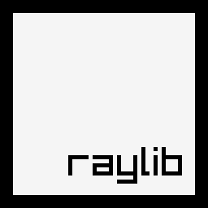

# Did I tell you that Bitcoin is the future and NFT a prank ?

  

### - 🔭 I’m currently working as a student at EPITECH Paris
### - 🌱 I’m currently learning about Machine Learning and Quantum Computing
### - ⚡ Fun fact: every minute 10,000 Dogecoins are created

<h1 align="left">Languages, Frameworks and Software I use</h1>

<h2 align="left">Software Development</h2>

  
  
  
  
  
  
  
  
  

<h2 align="left">DevOps</h2>

  
    
  
  
    

<h2 align="left">Data / AI</h2>

  
  
  
  
  
  
  
  
  
<h2 align="left">Web</h2>
<h3 align="left">WebApp</h3>
  
  
  
  
  

<h3 align="left"> Database</h3>

  
  
  
  
 

  <h3 align="left">Web3</h3>

  

<h3 align="left">Quality Assurance</h3>
  
  
<h2 align="left">Project Management</h2>
  
  
  
  

<h2 align="left">SysAdmin</h2>
  
  
  
  
  
  

<h2 align="left">Graphics Development</h2>
  
  
  

<h2 align="left">Building Software</h2>
  
  

